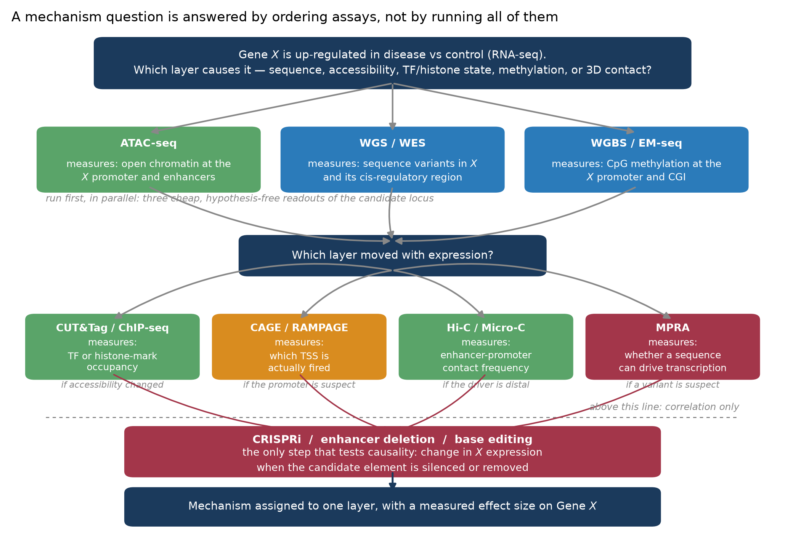
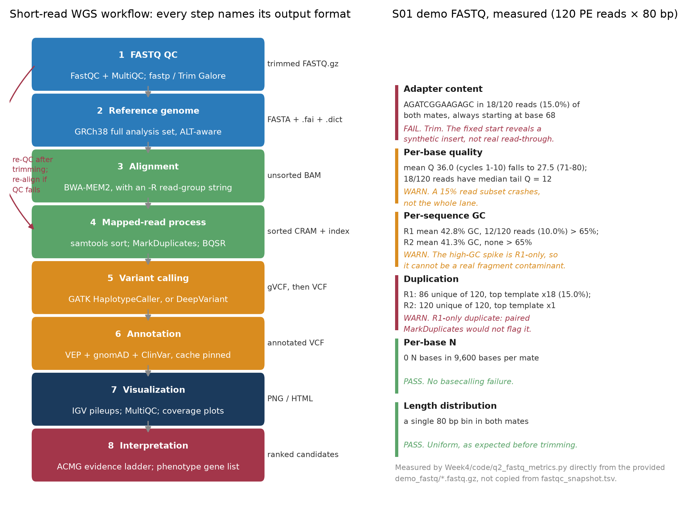
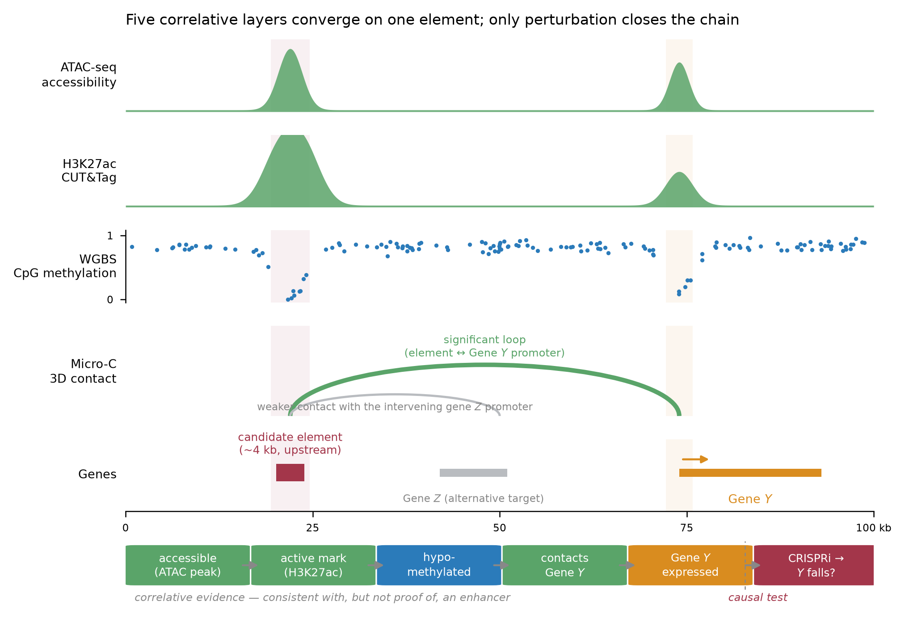
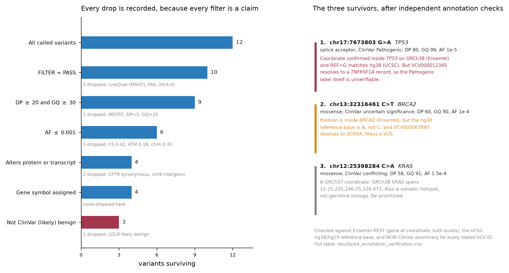

# Week 4 Homework Report
## Genomics — Sequencing, Variant Interpretation, and AI-Assisted Analysis

**Name:** Zhou Hanyi
**Student ID:** _(fill in)_
**Date:** 2026-09-17
**Course:** Bioinformatics: From Multi-Omics Data to Discovery

Everything in this report is reproducible from this folder. The three scripts in
`code/` regenerate every number, table and figure; the sources I checked are named
inline with the fact they support. Where a check *failed* — and several did — the
failure is reported rather than smoothed over, because on this dataset the failures
are the most informative result.

**A note on the data.** `data/README_data.md` states that the Q4 variant table and
the demo FASTQ are teaching synthetics. I took that at face value but still verified
them, because the useful exercise is not "are these real?" but "if I had trusted the
annotation columns, what would I have got wrong?" The answer turns out to be: quite a
lot (§4.3).

---

## Question 1 — Choose the Right Genomic Assay (25 pts)

### 1. Reasoning before AI

Gene *X* is up-regulated. The RNA-seq result is the *observation*; every candidate
mechanism — regulatory variant, accessibility, TF or histone state, methylation, 3D
contact — is a *hypothesis about a different molecular layer*. So the design problem
is not "which assay is best" but "which layer do I interrogate first, and what would
each answer tell me to do next."

**My first choice was ATAC-seq**, for three reasons:

1. It is the cheapest hypothesis-free readout that covers the largest number of the
   candidate mechanisms at once. An accessibility change at the *X* promoter or at a
   nearby element is consistent with altered TF binding, altered histone state, and
   altered methylation — all three tend to move accessibility with them.
2. It localises the problem in the genome. A differential ATAC peak gives me
   coordinates, which is what every subsequent assay needs as an input.
3. A *negative* ATAC result is also informative: if accessibility is unchanged, the
   promoter-proximal mechanisms drop in priority and I should look at 3D contact or
   at post-transcriptional explanations instead.

What ATAC-seq **cannot** prove: which factor is bound, whether the accessibility
change causes the expression change or follows it, and whether the element it
identifies acts on *X* rather than on a neighbouring gene.

I planned to run WGS/WES and WGBS in parallel with ATAC rather than after it,
because both are cheap, both interrogate a different layer, and neither depends on
the ATAC result to be interpretable.

### 2. AI-assisted workflow

I asked the AI agent to critique the design rather than replace it. The prompt,
abbreviated:

> "Here is my assay strategy for a gene up-regulated in disease: ATAC-seq + WGS +
> WGBS in parallel first, then a mechanism-specific second tier, then CRISPRi. Do not
> propose an alternative design. Instead: (a) name each step that is correlative and
> would not survive a reviewer asking for causality; (b) name any candidate mechanism
> my first tier cannot detect at all; (c) tell me where I have the assay's claim
> wrong — i.e. where I am attributing to an assay something it does not measure."

The three critiques worth keeping:

- **(b) was the substantive hit.** My first tier cannot detect an
  enhancer–promoter contact change. Hi-C/Micro-C is not redundant with ATAC: a loop
  can be gained or lost with no change in accessibility at either anchor. I had
  treated 3D contact as a downstream detail; it is a genuinely independent mechanism
  and belongs in the decision tree as a first-class branch.
- **(c) caught a real error in my wording.** I had written that ATAC-seq "shows
  which transcription factor is binding." It does not. Footprinting infers occupancy
  from a cleavage-protection pattern; it is an inference from a shape, not a
  measurement of identity. Only ChIP-seq/CUT&Tag/CUT&RUN, which use an antibody
  against a named protein, measure *which* factor is there.
- **(a)** confirmed what I already had: everything above the perturbation step is
  correlation. I had drawn that line already, so this was a check, not a change.

The agent also suggested adding Hi-C to the *first* tier. I rejected that — see
below.

### 3. Verification

| Claim to check | Source | Outcome |
|---|---|---|
| ATAC-seq footprinting infers, not measures, TF identity | Buenrostro et al., *Nat Methods* 2013, 10:1213 (doi:10.1038/nmeth.2688), original ATAC-seq description | Confirmed. I corrected my wording. |
| Hi-C/Micro-C detects contact changes independent of accessibility | Hsieh et al., *Cell* 2015, 162:108 (Micro-C, doi:10.1016/j.cell.2015.05.048); Rao et al., *Cell* 2014, 159:1665 (doi:10.1016/j.cell.2014.11.021) | Confirmed. Loop calls are made on contact frequency, not on anchor accessibility. |
| MPRA tests whether a sequence *can* drive transcription, not whether it *does* at its native locus | Melnikov et al., *Nat Biotechnol* 2012, 30:271 (doi:10.1038/nbt.2137) | Confirmed. MPRA is episomal, so it reports intrinsic regulatory potential out of chromatin context. This is exactly why it cannot substitute for CRISPRi. |
| CRISPRi silences without cutting, so the element is perturbed rather than deleted | Gilbert et al., *Cell* 2013, 154:442 (doi:10.1016/j.cell.2013.06.044) | Confirmed. Relevant to my design because a deletion also removes spacing and could disrupt an unrelated element. |

**Where I rejected the AI's advice.** It proposed putting Hi-C/Micro-C in the first
tier. I kept it in the second tier, because Micro-C at the read depth needed to call
a specific loop confidently is roughly an order of magnitude more expensive per
sample than ATAC-seq, and because I only need it on the branch where the driver is
*distal*. Cost-per-hypothesis-excluded, not assay quality, decided the ordering. The
AI could not make that call because it does not know my budget — this is a decision
the analyst owns.

### 4. Final conclusion



*Figure Q1 — Assay strategy for assigning a mechanism to the up-regulation of Gene X.
Three parallel first-tier screens interrogate three independent molecular layers; a
decision node routes to a mechanism-specific second tier; only the final step
(CRISPRi / deletion / base editing) tests causality. Everything above the dashed line
is correlation.*

**~200-word explanation.** Each assay reads one physical property and nothing more.
RNA-seq counts transcripts, so it establishes the phenotype but cannot say why.
WGS/WES reads sequence and can find a candidate regulatory variant, but a variant's
presence is not evidence that it does anything. ATAC-seq reports how accessible
chromatin is to Tn5; it localises candidate elements but cannot name the factor
involved, because it measures a cleavage pattern rather than protein identity.
ChIP-seq, CUT&Tag and CUT&RUN use an antibody, so they do name the factor or
histone mark — but occupancy is not function. WGBS/EM-seq quantifies CpG
methylation, which correlates with silencing without establishing direction of
causality. CAGE/RAMPAGE maps which TSS actually fires. Hi-C/Micro-C measures contact
frequency, which is independent of accessibility: a loop can change with both anchors
equally open. MPRA asks whether a sequence *can* drive transcription, episomally and
out of native chromatin, so a positive result proves capacity, not native activity.
Only CRISPR perturbation manipulates the variable and measures Gene *X* — the single
step that converts correlation into causality. The assays complement each other
because each one's blind spot is another's readout, and every correlative layer
narrows the hypothesis space that the expensive perturbation must then test.

> **The biological question chooses the assay because** the question names the
> molecular layer where the answer must live, and each assay reads exactly one layer —
> so the mapping from question to assay is fixed before any cost, convenience or
> familiarity argument is allowed to enter. Choosing the assay first and then looking
> for a question it can answer inverts the logic and produces a result that is
> technically sound and biologically unusable.

---

## Question 2 — From FASTQ to a Trustworthy Analysis Workflow (25 pts)

Assay assumed for this workflow: **germline short-read WGS** (sample S01 in
`data/sample_manifest.csv` is `condition=control, assay=WGS`).

### 1. Reasoning before AI

My own eight-step outline, with the purpose of each step, written before prompting:

| Step | Purpose | Output / checkpoint |
|---|---|---|
| 1. FASTQ QC | Decide whether the library is usable *at all*, and what must be trimmed, before spending CPU on alignment | FastQC/MultiQC report; trimmed FASTQ.gz; re-QC after trimming |
| 2. Reference genome | Fix the coordinate system for every downstream file. Must be chosen once and recorded, because every coordinate, annotation cache and population-frequency lookup is relative to it | GRCh38 analysis set FASTA + `.fai` + `.dict` |
| 3. Alignment | Assign reads to genomic positions with a mapping quality I can filter on | Unsorted BAM with a populated `@RG` read-group line |
| 4. Mapped-read processing | Remove artefacts that would be read as genotype evidence: PCR duplicates inflate allele support, and unsorted files cannot be indexed | Coordinate-sorted, duplicate-marked, indexed CRAM |
| 5. Variant calling | Convert pileups into genotypes with a calibrated quality | gVCF, then a joint-genotyped VCF |
| 6. Annotation | Attach consequence, gene, and population frequency — the fields that make a variant interpretable | VEP-annotated VCF |
| 7. Visualization | Look at the evidence before believing the table. A pileup at a top candidate catches strand bias and alignment artefacts that no metric flagged | IGV screenshots; MultiQC summary |
| 8. Interpretation | Rank candidates against the phenotype using an explicit evidence ladder | Ranked candidate table with reasons |

The ordering constraint I care about most: **step 2 must be decided before step 3,
and never revisited afterwards.** Mixing builds is not recoverable by re-annotating;
it silently produces coordinates that point at the wrong gene. (Q4 turned out to be a
live demonstration of exactly this failure — §4.3.)

### 2. AI-assisted workflow

Plan-first prompt, abbreviated:

> "Before writing any command: produce a plan for a germline short-read human WGS
> pipeline as a numbered list of steps, and for each step give (i) the input format,
> (ii) the output format, (iii) the decision that must be made by a human, and (iv)
> the failure mode if the step is skipped. Do not give me commands yet. When the plan
> is agreed, give the commands, and flag any parameter whose default you are not
> confident is right for GRCh38."

Working this way surfaced two things a command-first prompt would have buried: the
distinction between the *primary assembly* and the *full analysis set* of GRCh38
(step 2), and the fact that BQSR's value depends on the caller (step 4). Both are
human decisions, and both were presented to me as decisions rather than as defaults.

The commands it then proposed were conventional: `fastp` → `bwa-mem2 mem` →
`samtools sort` → `gatk MarkDuplicates` → `gatk HaplotypeCaller -ERC GVCF` →
`GenotypeGVCFs` → `vep`. Two of its recommendations did not survive verification.

### 3. Verification

**FastQC metrics — measured, not quoted.** The homework allows interpreting
`fastqc_snapshot.tsv`. I instead recomputed the modules from the reads with
[`code/q2_fastq_metrics.py`](code/q2_fastq_metrics.py) so the snapshot could be
*checked*. Full output: [`results/q2_fastq_observed_metrics.tsv`](results/q2_fastq_observed_metrics.tsv)
and `results/q2_fastq_measured.json`.

| Metric | What I looked for | Interpretation |
|---|---|---|
| **Adapter content** | Presence and *position* of `AGATCGGAAGAGC` | Found in 18/120 reads (15.0%) in **both** mates — and every single occurrence begins at exactly base 68. Real adapter read-through starts at a position set by the insert length, so it is spread across many positions. A single fixed offset means the adapter was concatenated onto a fixed-length template. **Decision: trim and re-QC, but do not interpret the insert-size distribution of this file.** |
| **Per-base sequence quality** | Whether the drop is a lane-wide decay or a read subset | Mean Q falls from 36.0 (cycles 1–10) to 27.5 (cycles 71–80), lowest per-cycle mean 27.15 at cycle 80. But the mean understates it: 18/120 reads (15.0%) have a mean tail Q below 20, with median Q = 12 inside that subset. So the snapshot's "median Phred ~12 after cycle 50" describes a **15% subset**, not the per-cycle average. **Decision: quality-trim from the 3′ end rather than discard the whole run.** |
| **Per-sequence GC content** | Whether the high-GC shoulder appears in both mates | R1: mean 42.8% GC, with 12/120 reads (10.0%) above 65% GC — a clear second mode. R2: mean 41.3% GC, **zero** reads above 65%. A genuine high-GC contaminant is a *fragment*, so both mates must carry it. **The shoulder is R1-only, therefore not a real contaminant.** |
| **Sequence duplication levels** | Whether the duplicate is a duplicated *fragment* | R1: 86 unique sequences of 120, top template present 18× (15.0%). R2: 120 unique of 120, top template 1×. A PCR duplicate is identical in both mates, so `MarkDuplicates` — which keys on the aligned positions of the *pair* — would not flag these at all. **The R1-only duplicate is a FASTQ-level artefact that the standard duplicate-marking step cannot see.** |
| **Per-base N content** | Basecalling failure | 0 N bases in 9,600 bases per mate. PASS, and consistent with the snapshot. |
| **Sequence length distribution** | Trim settings / instrument config | A single 80 bp bin in both mates. PASS before trimming; after trimming this becomes multimodal by design and that is expected, not a red flag. |

Two of these (GC and duplication) are discrepancies with the snapshot's framing, and
both point the same way: the traps were planted into R1 only, so they are internally
incoherent as sequencing artefacts. That is not a criticism of the teaching file — it
is the point of checking.

**AI-audit table.**

| AI recommendation | My verification (doc / source) | Final decision |
|---|---|---|
| "Align to the GRCh38 primary assembly." | NCBI Analysis Set documentation (GCA_000001405.15 GRCh38 no-alt / full analysis set) and the GATK Resource Bundle's reference notes. The analysis set adds decoy contigs (EBV, hs38d1) and hard-masks the pseudo-autosomal region on chrY. Omitting decoys leaves reads from those sequences to mismap onto real chromosomes. | **Rejected as stated.** Use the GRCh38 **full analysis set**, and record whether it is the alt-aware or no-alt variant. Named explicitly in the workflow figure. |
| "Run BQSR after MarkDuplicates." | GATK germline short-variant best-practices documentation, and the DeepVariant README. BQSR is part of the HaplotypeCaller pipeline; DeepVariant's model is trained on non-recalibrated reads and BQSR is not recommended before it. | **Modified.** BQSR is conditional on the caller, and the known-sites VCFs must be the ones matching the chosen reference. Marked "optional" in the figure rather than mandatory. |
| "FastQC PASS/WARN/FAIL tells you whether the library is usable." | FastQC documentation on module thresholds: the status flags assume a random-library, whole-genome context and are explicitly noted as misleading for enriched or targeted libraries. | **Rejected.** For the ATAC-seq and RNA-seq rows of `sample_manifest.csv`, high duplication and non-genomic GC are *expected*, not failures. I interpret each module against the assay, and never treat FAIL as an exclusion criterion by itself. |
| "Trim adapters, then proceed to alignment." | My own measurement above. | **Modified.** Trim, then **re-QC**, and only then align. This is drawn as a feedback loop in the figure rather than a straight line, because the check after trimming is what tells you the trimming worked. |
| "MarkDuplicates will handle the duplication flagged by FastQC." | My own measurement: the duplicate exists in R1 only. `MarkDuplicates` keys on the mapped coordinates of the read *pair*. | **Rejected.** This particular duplicate is invisible to `MarkDuplicates`. Had I accepted the recommendation I would have believed a problem was solved when nothing had touched it. |
| "Use `bwa mem`." | bwa-mem2 documentation: same algorithm and output, ~2–3× faster. | **Accepted with substitution** to `bwa-mem2`; I record the exact version in the run log, since aligner version changes mapping in edge cases. |

Verification checklist: genome build named explicitly (GRCh38 full analysis set) ☑ ·
formats correct at every step (FASTQ → BAM/CRAM → gVCF → VCF) ☑ · software named,
versions to be pinned in the run log ☑ · BQSR, decoys, and trim-then-re-QC justified
rather than defaulted ☑ · AI suggestions rejected or modified at four of six rows ☑

### 4. Final conclusion



*Figure Q2 — Left: the eight-step germline WGS workflow, each step labelled with the
tool and the file format it emits; the red arc is the trim-then-re-QC loop. Right: the
six FastQC modules recomputed from the S01 demo reads, with the decision each one
drives. The GC and duplication rows are R1-only, which is why they cannot be real
sequencing artefacts.*

> **The analyst, not the AI, is responsible for** the choices that the pipeline
> cannot check for itself: which reference build and analysis set the coordinates
> refer to, whether a QC flag is a failure or an expected property of the assay,
> whether a proposed step actually addresses the artefact it was proposed for, and
> whether the final result is biologically meaningful rather than merely
> syntactically valid. The AI produced a runnable pipeline in one pass; four of its
> six recommendations still needed to be rejected or modified, and one of them —
> that `MarkDuplicates` would handle the observed duplication — would have left a
> real artefact in the data while making me believe it had been removed. A pipeline
> that runs cleanly end-to-end is not evidence that any of it was right, and only
> the analyst is in a position to know that.

---

## Question 3 — Multi-Omics Regulatory Hypothesis (25 pts)

### 1. Reasoning before AI

Read independently, layer by layer, before integrating:

- **ATAC-seq.** A discrete accessibility peak over the candidate region. Nucleosome-depleted; something is holding it open. Says nothing about *what*, or about which gene it serves.
- **H3K27ac.** Enrichment flanking the accessible core, with the characteristic bimodal shape around a nucleosome-depleted centre. This is the acetylation pattern associated with active enhancers — but H3K27ac also marks active promoters, so the mark alone does not distinguish "enhancer" from "unannotated promoter."
- **DNA methylation.** A localised hypomethylated block coinciding with the ATAC peak. Consistent with an occupied, active element. Direction of causality is genuinely unknown here: TF binding excludes DNMTs, and demethylation permits TF binding, and both happen.
- **Hi-C/Micro-C.** A significant contact between the candidate element and the Gene *Y* promoter. This is the only layer that connects the element to a specific gene. It also shows a weaker contact with an intervening promoter, which is the seed of the alternative explanation.
- **RNA-seq.** Gene *Y* is expressed in this condition. One condition only, so there is no correlation across conditions to speak of — this is a single consistency check, not evidence of regulation.

**Preliminary integrated model.** The element is open, carries an active-enhancer
histone signature, is hypomethylated, physically contacts the *Y* promoter, and *Y* is
transcribed. Every layer is consistent with the element being an active enhancer of
Gene *Y*.

**My own open question before prompting:** every one of those five statements is a
statement about *state in one condition*. Nothing in the data distinguishes "this
element drives *Y*" from "this element and *Y* are both downstream of the same
upstream state." Five consistent correlative layers are still zero causal
observations — consistency is not additive in the way it feels like it should be.

### 2. AI-assisted workflow

> "For each of these five layers, split my reading into three lists: (1) direct
> observations — what the assay physically measured; (2) biological interpretations —
> what I inferred; (3) missing evidence — what would be required to license the
> inference. Be strict: if I have written an interpretation as though it were an
> observation, move it. Do not propose experiments yet."

This was the useful part of the exercise. Two of my "observations" were
interpretations wearing an observation's clothes:

- I had written "the element is an active enhancer" under H3K27ac. That is an
  interpretation. The observation is "H3K27ac reads are enriched over this interval."
  The word *enhancer* imports a function the antibody cannot see.
- I had written "hypomethylation opens the element" under methylation. Also an
  interpretation, and a directional one. The observation is only "methylation is
  lower here than in flanking sequence."

I did not accept the agent's framing wholesale. It initially listed the Hi-C loop as
"direct observation: the element regulates Gene *Y*." That is wrong twice over: a
contact is not regulation, and Hi-C measures ligation frequency between crosslinked
fragments — the "loop" is already a statistical call made by a peak-caller on a
contact matrix, so even the contact is an inference with a significance threshold
attached. I corrected it to "direct observation: significantly elevated ligation
frequency between the two loci," which is what was measured.

### 3. Verification

| Claim | Source | Outcome |
|---|---|---|
| H3K27ac marks active enhancers *and* active promoters | Creyghton et al., *PNAS* 2010, 107:21931 (doi:10.1073/pnas.1016071107) — the paper that established H3K27ac as an active-enhancer mark, which also reports it at active promoters | Confirmed. The mark cannot on its own distinguish enhancer from unannotated promoter. My Q3 alternative hypothesis rests on this. |
| Contact frequency does not imply regulation; loop calls are threshold-dependent | Rao et al., *Cell* 2014, 159:1665 (doi:10.1016/j.cell.2014.11.021); Fulco et al., *Nat Genet* 2019, 51:1664 (doi:10.1038/s41588-019-0538-0) | Confirmed, and strengthened. Fulco et al. perturbed thousands of candidate elements with CRISPRi and found that contact alone is a poor predictor of a functional effect; the predictive quantity combines contact with activity. So "there is a loop" is weak evidence by itself. |
| CRISPRi acts locally enough to attribute an effect to one element | Gilbert et al., *Cell* 2013, 154:442 (doi:10.1016/j.cell.2013.06.044); Fulco et al. 2019, as above, for the enhancer-screening application | Confirmed, with the caveat that KRAB-dCas9 spreads repressive chromatin over a window of roughly a kilobase, so a neighbouring element inside that window cannot be excluded by CRISPRi alone. This is why my design includes the tiling control. |

**Observations vs interpretations vs missing evidence.**

| Layer | Direct observation | Interpretation | Missing evidence |
|---|---|---|---|
| **ATAC-seq** | Tn5 insertion density is elevated over a ~1 kb interval relative to flanking sequence | The region is nucleosome-depleted and occupied by protein | Which protein. Footprinting infers occupancy from a cleavage shape; it does not identify a factor |
| **H3K27ac** | H3K27ac reads are enriched over the interval, bimodally around a depleted centre | The element is in an active chromatin state typical of enhancers | Whether this is an enhancer or an unannotated promoter. CAGE/RAMPAGE would separate them by asking whether a TSS fires here |
| **Methylation** | CpG methylation is lower across the interval than in flanking sequence | The element is unmethylated because it is occupied and active | Direction of causality, and whether hypomethylation is a cause or a consequence of occupancy. Requires a time course or a targeted-methylation perturbation (e.g. dCas9–DNMT3A) |
| **Hi-C / Micro-C** | Ligation frequency between the element and the *Y* promoter bin is significantly above the distance-matched expectation | The element and the *Y* promoter are in physical proximity, consistent with an enhancer–promoter loop | Whether the contact is *required* for *Y* expression. Also loop-caller sensitivity: the call depends on resolution, normalisation and threshold |
| **RNA-seq** | Gene *Y* transcripts are detected at a given level in this condition | *Y* is actively transcribed, consistent with an active enhancer nearby | Everything about dependence. One condition gives no covariation. Needs multiple conditions, or a perturbation |

**Alternative explanation.** The element is the **promoter of an unannotated
transcript** — most plausibly an eRNA or a lncRNA — and not an enhancer of *Y* at all.
Every observation survives this reading: a promoter is accessible, is flanked by
H3K27ac, is hypomethylated, and sits inside the same topological domain as *Y*, which
is sufficient to produce an above-background contact with the *Y* promoter without any
regulatory relationship. Gene *Y*'s expression would then be driven by something else
in the domain. A second, weaker alternative is visible in the data itself: the element
also contacts an intervening promoter (Gene *Z* in the figure), so even if it is an
enhancer, *Y* may not be its target.

**Functional experiment.**

| Field | Answer |
|---|---|
| Experiment type | **CRISPRi (KRAB–dCas9)** tiling the candidate element, with RT-qPCR / RNA-seq readout on Gene *Y* |
| What is perturbed | Chromatin state at the element — silenced *in situ*, in its native locus, without cutting DNA and without removing sequence or altering spacing |
| Expected result if the enhancer model is causal | Gene *Y* transcript falls on silencing the element; the effect is strongest for guides over the ATAC peak summit and decays with distance from it |
| Expected result if the alternative is true | Gene *Y* is unchanged, while the local unannotated transcript (assayed by RT-qPCR with element-proximal primers, or by CAGE) falls. If the true target is Gene *Z*, *Z* falls and *Y* does not |
| Key controls | (i) Non-targeting guides. (ii) Guides against the *Y* promoter itself — a positive control that the readout can detect a fall in *Y*. (iii) A tiling series across and beyond the element, because KRAB spreads over roughly a kilobase and a neighbouring element inside that window would otherwise be mistaken for the candidate. (iv) A second unrelated housekeeping gene, to show the effect is not global. (v) dCas9-only (no KRAB), to separate steric guide binding from the repressive domain |

Why CRISPRi rather than MPRA or deletion: MPRA is episomal and answers a different
question — whether the sequence *can* drive transcription out of chromatin context,
not whether it *does* at its locus. Deletion removes sequence and changes the spacing
between everything on either side, so a negative result on *Y* is confounded.

### 4. Final conclusion



*Figure Q3 — The candidate locus across five layers (shaded: candidate element in red,
Gene Y promoter in orange), and the logic chain below. Accessibility → chromatin state
→ methylation → 3D contact → expression are all read in one condition and are all
correlative; the dashed break marks the point where perturbation is required. Gene Z
is drawn because the element also contacts its promoter — the alternative target.*

**~200-word interpretation.** Five layers converge on one element, and the convergence
is genuinely informative: the region is accessible, flanked by H3K27ac, hypomethylated,
in significant contact with the Gene *Y* promoter, and *Y* is transcribed. That
combination is what an active enhancer looks like. But the five observations are not
five independent tests of the enhancer hypothesis. Accessibility, active acetylation
and hypomethylation are three correlated readouts of the same underlying state —
protein occupancy at an open element — so they largely co-occur whether the element
is an enhancer or an unannotated promoter. The contact adds the only gene-specific
information, and CRISPRi screens have shown that contact alone predicts functional
dependence poorly. Every layer is measured in a single condition, so there is no
covariation to exploit, and nothing distinguishes the element driving *Y* from both
being downstream of a shared upstream state. The competing model — that this is the
promoter of an unannotated transcript inside the same domain as *Y* — explains all
five observations equally well. Stacking correlative layers therefore raises my prior
but cannot close the argument: only perturbing the element and measuring *Y* can
distinguish the two.

> **The candidate element regulates Gene Y by** acting as a cis-regulatory enhancer
> whose occupied, hypomethylated, H3K27ac-flanked chromatin is brought into physical
> contact with the Gene *Y* promoter, and whose activity is required for the observed
> level of *Y* transcription, **and this can be tested by** tiling CRISPRi
> (KRAB–dCas9) across the element in the same cell type and measuring Gene *Y* by
> RT-qPCR/RNA-seq — with *Y*-promoter guides as a positive control, non-targeting
> guides and dCas9-without-KRAB as negative controls, and readouts on the local
> unannotated transcript and on Gene *Z* to discriminate the unannotated-promoter and
> wrong-target alternatives.

---

## Question 4 — Variant Prioritization (25 pts)

### 1. Reasoning before AI

Filtering logic, with thresholds fixed before writing any code:

| Criterion | Rule / threshold | Rationale |
|---|---|---|
| FILTER | `== PASS` | A non-PASS call is the caller's own statement that it does not trust the site. Overriding it requires a reason, and I have none here |
| Depth (DP) | `>= 20` | Below roughly 20×, a heterozygous site can be missed by allelic dropout or invented from a few misaligned reads. This is conventional territory for confident germline genotyping |
| Genotype quality (GQ) | `>= 30` | PHRED-scaled: *P*(genotype wrong) < 10⁻³ |
| Allele frequency (AF) | `<= 0.001` | A highly penetrant dominant disease allele cannot be common in the population. 0.1% is deliberately looser than the ~0.01% often used, so nothing borderline is discarded |
| Consequence | `stop_gained`, `frameshift`, `splice_acceptor`, `splice_donor`, `missense` | These can change the protein product or the transcript. Synonymous, intronic and intergenic calls are down-weighted, not because they are never functional, but because nothing in this table lets me evaluate them |
| ClinVar | Drop `Benign` / `Likely_benign`; keep `Pathogenic`, VUS, `Conflicting` | Benign is *positive evidence against*, unlike a missing annotation. `Conflicting` is treated as absence of consensus, **not** as evidence for pathogenicity |
| Gene relevance | Require a gene symbol | Without a gene there is no interpretable biological target in this table |

**Hard excludes:** non-PASS FILTER; DP < 20 or GQ < 30; AF > 0.001; ClinVar
(Likely_)benign. **Soft ranks (kept, down-weighted):** `Conflicting` ClinVar labels;
missense relative to truncating/splice consequences.

One thing I decided in advance and want to flag: the `NOTE` column is a teaching
hint, and I did not use it in the filter. Filtering on a free-text hint column would
make the exercise circular.

### 2. AI-assisted workflow

> "Plan first, no code. I intend to filter this variant table on FILTER, DP, GQ, AF,
> consequence and ClinVar label, then rank the survivors. Before you write anything:
> tell me which of these filters can silently discard a true positive, and tell me in
> what order they should be applied so that I can still see what each one removed."

The plan-first answer changed my implementation in one structural way. My first
instinct was a chained `dplyr::filter()`. The agent pointed out that a chained filter
destroys the audit trail: you see what survived, never what died or why, and in a
clinical triage the dropped rows are exactly the ones you have to defend. So
[`code/q4_filter.R`](code/q4_filter.R) scores **every** variant against **every**
criterion first and records a `drop_reason`, then selects. The by-product,
[`results/q4_filter_trace.tsv`](results/q4_filter_trace.tsv), is the defensible
artefact; `results/q4_shortlist.tsv` is just its `kept == TRUE` subset.

It also flagged that `AF <= 0.001` would discard a recessive founder allele, which can
reach several percent in a specific population. Correct, and worth recording: my
threshold encodes an assumption of a rare dominant model. For a recessive hypothesis I
would need to raise the ceiling and add a genotype/zygosity requirement — and this
table has no zygosity column, so that model cannot be tested here at all.

### 3. Verification

I verified the annotation columns rather than trusting them, using
[`code/q4_verify_annotations.py`](code/q4_verify_annotations.py). Three independent
resources:

1. **Ensembl REST** (`/overlap/region/human/…?feature=gene`, and the GRCh37 mirror) —
   which gene actually overlaps each stated coordinate, in each build.
2. **UCSC REST** (`/getData/sequence`, hg38 and hg19) — the actual reference base at
   each stated position.
3. **NCBI E-utilities** (`esummary.fcgi?db=clinvar`) — what each stated `CLINVAR_ID`
   actually refers to.

Full results: [`results/q4_annotation_verification.csv`](results/q4_annotation_verification.csv).
Three findings, all material:

**(a) Every ClinVar accession in the table refers to a different gene.** All ten IDs
are real, retrievable ClinVar records — and not one of them describes the variant it
is attached to:

| Stated | Stated gene | What NCBI returns for that accession |
|---|---|---|
| VCV000012345 | *TP53* | *TNFRSF1A* c.295T>A (p.Cys99Ser) |
| VCV000067890 | *BRCA2* | *SCN5A* c.4412A>G (p.Asn1471Ser) |
| VCV000000111 | *F5* | *VIPAS39* c.535C>T (p.Gln179Ter) |
| VCV000000222 | *CFTR* | *AGA* c.179G>A (p.Gly60Asp) |
| VCV000000333 | *MSH2* | *NF1* c.5186_5190del (p.Ala1729fs) |
| VCV000000444 | *HLA-A* | *DUOXA2* c.738C>G (p.Tyr246Ter) |
| VCV000000555 | *ATM* | *FECH* c.314+2T>G |
| VCV000000666 | *LDLR* | *PROC* c.1000G>A (p.Gly334Ser) |
| VCV000000777 | *MECP2* | *SACK1H* c.860C>A (p.Ser287Ter) |
| VCV000000888 | *KRAS* | *ARSB* c.1143-8T>G |

The data README says the IDs are placeholders, so this is expected — but the
consequence for the analysis is not cosmetic. **The `CLINVAR_SIG` column is
unverifiable.** Every clinical label in this table is an assertion with no retrievable
supporting record, which means the ClinVar filter I designed is the least defensible
step in my own workflow. I kept it, because the exercise defines those labels as
given; I report its status honestly rather than presenting it as verified evidence.

**(b) The coordinates mix genome builds.** Checked against both Ensembl assemblies:

| Variant | Stated gene | Gene at that coordinate in GRCh38 | Gene at that coordinate in GRCh37 |
|---|---|---|---|
| chr7:117199644 | *CFTR* | ***ST7*** | *CFTR* |
| chr19:11200200 | *LDLR* | ***DOCK6* / *DOCK6-AS1*** | *LDLR* |
| chr12:25398284 | *KRAS* | **no gene** (GRCh38 *KRAS* = 12:25,205,246–25,326,473) | *KRAS* |
| chrX:153870000 | *MECP2* | ***L1CAM*** | ***IKBKGP1*** (GRCh37 *MECP2* = X:153,287,024–153,363,212) |
| chr1:169519049 | *F5* | *F5* ✓ | *F5* (the gene spans the position in both builds) |
| chr17:7673803 | *TP53* | *TP53* ✓ | *DNAH2* |
| chr13:32316461 | *BRCA2* | *BRCA2* ✓ | *RXFP2* |
| chr2:47641560 | *MSH2* | *MSH2* ✓ | *MSH2* (spans the position in both builds) |
| chr6:29942857 | *HLA-A* | *HLA-A* ✓ (with an unnamed pseudogene and *POLR1HASP*) | no gene |
| chr11:108323000 | *ATM* | *ATM* / *C11orf65* ✓ | *C11orf65* only |
| chr8:128750000 | *.* | unnamed lncRNA / *CCDC26* | *MYC* |
| chr4:88000000 | *.* | two unnamed lncRNAs | *AFF1* |

Three rows are GRCh37 coordinates presented in a table alongside GRCh38 ones.
`chr12:25398284` is recognisable: it is the GRCh37 position of the *KRAS* codon-12
hotspot, whose GRCh38 position is 12:25,245,350. Had I annotated this table against
GRCh38 without checking, VEP would have assigned the *CFTR* row to *ST7*, the *LDLR*
row to *DOCK6*, and the *MECP2* row to *L1CAM* — three wrong genes, no error raised.
This is the exact failure mode I identified as the ordering constraint in Q2.

**(c) Only 3 of 12 reference alleles match GRCh38.** From UCSC: `REF` matches hg38 at
exactly three positions — chr17:7673803 (G), chr7:117199644 (C) and chr8:128750000 (A)
— and disagrees at the other nine. Notably, it matches at my **rank-1** candidate
(*TP53*, stated G = hg38 G) but not at my **rank-2** one (*BRCA2*, stated C vs hg38 A),
so the reference check discriminates between my top two rather than condemning both.
This independently confirms the table is synthetic and, more usefully, tells me that a
real VCF with this property would have failed validation before annotation. Any real
pipeline should run `bcftools norm --check-ref` against the reference FASTA first; that
single check would have caught (b) and (c) together.

**Sources used:** (1) Ensembl REST API (GRCh38 and GRCh37 mirrors) — gene at
coordinate, gene spans; (2) UCSC Genome Browser REST API — hg38/hg19 reference bases;
(3) NCBI ClinVar via E-utilities — record identity for every stated accession.

### 4. Final conclusion



*Figure Q4 — Left: the filter cascade, 12 → 3, with the variant dropped at each step
named. Right: the three survivors, each annotated with the result of the independent
Ensembl/UCSC/ClinVar checks.*

**Shortlist (3 of 12).** Full table: [`results/q4_shortlist.tsv`](results/q4_shortlist.tsv).

| Rank | CHROM | POS | REF | ALT | GENE | CONSEQUENCE | ClinVar | DP | GQ | AF | Why kept |
|---|---|---|---|---|---|---|---|---|---|---|---|
| 1 | chr17 | 7673803 | G | A | *TP53* | splice_acceptor_variant | Pathogenic | 80 | 99 | 1×10⁻⁵ | Highest-confidence call in the table; the only survivor with a truncating-class consequence and a Pathogenic label |
| 2 | chr13 | 32316461 | C | T | *BRCA2* | missense_variant | Uncertain_significance | 60 | 90 | 1×10⁻⁴ | Passes every technical filter; rare; a clinically actionable gene. Consequence and label are both weaker than rank 1 |
| 3 | chr12 | 25398284 | C | A | *KRAS* | missense_variant | Conflicting | 58 | 91 | 1.5×10⁻⁴ | Survives the filters, but de-prioritised: conflicting label is not evidence, and *KRAS* codon-12 biology is somatic, not germline |

**Top candidate for investigation: chr17:7673803 G>A in *TP53*.** Second:
chr13:32316461 C>T in *BRCA2*, as a VUS only.

**False-lead critique.** I asked the agent for the strongest reasons the top variant
could be a false lead, then decided which concerns are scientifically real:

| Concern raised | Scientifically important? | Why |
|---|---|---|
| The `CLINVAR_SIG` label is unverifiable — VCV000012345 is a *TNFRSF1A* record | **Yes — the most important one** | My rank-1 ranking leans on "Pathogenic," and that label has no retrievable supporting record. Strip it and rank 1 rests on consequence class and call quality alone, which is still the best in the table but much weaker |
| `splice_acceptor_variant` is a prediction, not an observation | **Yes** | The consequence is assigned by annotation software from position relative to an annotated transcript. Whether the splice site is actually disrupted is an RNA-level question that no DNA-level evidence can settle |
| *TP53* alterations are overwhelmingly somatic; a germline *TP53* finding implies Li–Fraumeni syndrome | **Yes** | This changes the interpretation entirely. Without knowing whether the sample is tumour or germline — `sample_manifest.csv` says only "control"/"case" — I cannot say which model applies |
| The reference base could be wrong, making the call an artefact | **No, in this instance** | I checked: hg38 chr17:7673803 is G, matching `REF`. This was a real concern that verification retired — unlike at ranks 2 and 3, where it stands |
| AF = 1×10⁻⁵ may come from an under-powered population panel | **Partly** | A synthetic AF cannot be assessed. In real work I would read the gnomAD allele count and coverage at the site, not the frequency alone — AF 1×10⁻⁵ from 2 observed alleles is a different fact from AF 1×10⁻⁵ from 20 |
| Single-sample calls without a matched normal or parents cannot establish inheritance | **Yes** | De novo status, phase, and zygosity are all absent from this table. Zygosity in particular means no recessive model can even be tested |

**Concerns I accept as remaining risk:** the ClinVar label is taken as given by the
exercise and cannot be independently confirmed; the splice consequence is a prediction;
and I have no phenotype, zygosity, or germline/somatic context. I am therefore
prioritising this variant for *investigation*, which is what the question asks — not
reporting it as a finding.

**~200-word interpretation.**

*Known evidence.* The call is technically the strongest in the table: FILTER=PASS,
DP 80, GQ 99, AF 1×10⁻⁵. Its coordinate verifies against GRCh38 — the position sits
inside *TP53* in Ensembl and the stated reference base G matches hg38 in UCSC. Its
stated ClinVar label does not verify: VCV000012345 returns a *TNFRSF1A* record.

*Computational inference.* The variant is annotated `splice_acceptor_variant`, i.e.
predicted to disrupt the 3′ splice site of a *TP53* intron. Loss of an acceptor
typically causes exon skipping or intron retention, either of which can shift the
reading frame and truncate p53's DNA-binding domain. This is a prediction from
position relative to an annotated transcript, not an observation of splicing.

*Scientific hypothesis.* The variant abolishes the acceptor site, producing a
mis-spliced *TP53* transcript and a non-functional or unstable p53 protein, with
consequent loss of p53-dependent transcriptional response.

*Required experiment.* RNA from the carrier: RT-PCR across the junction plus targeted
long-read cDNA sequencing to observe the actual transcript, and an allele-specific
minigene splicing reporter to attribute the effect to this allele. If a mis-spliced
product is confirmed, assay p53 function — p21 induction after DNA damage — in carrier
cells.

> **Variant** chr17:7673803 G>A in *TP53* **may influence** p53-dependent tumour
> suppression **by affecting** recognition of a canonical 3′ splice acceptor site,
> producing a mis-spliced transcript and a truncated or unstable p53 protein; **this
> can be tested by** RT-PCR and targeted long-read cDNA sequencing across the junction
> in carrier RNA, an allele-specific minigene splicing assay to attribute the defect
> to this allele, and a p21-induction assay after DNA damage to confirm loss of p53
> transcriptional function.

---

## Appendix

### A1. Files in this submission

| Path | Contents |
|---|---|
| `Week4_Homework_Report.md` | This report |
| `figures/Q1_workflow.png` | Q1 assay strategy |
| `figures/Q2_workflow.png` | Q2 WGS workflow + measured QC |
| `figures/Q3_locus_chain.png` | Q3 locus tracks + logic chain |
| `figures/Q4_prioritization.png` | Q4 filter cascade + survivors |
| `code/q2_fastq_metrics.py` | Recomputes FastQC-style modules from the demo reads |
| `code/q4_filter.R` | Completed Q4 filter; writes shortlist + full drop trace |
| `code/q4_verify_annotations.py` | Ensembl / UCSC / ClinVar verification of the Q4 table |
| `code/make_figures.py` | Regenerates all four figures |
| `results/q2_fastq_observed_metrics.tsv` | Measured QC vs snapshot claim, per module |
| `results/q2_fastq_measured.json` | Raw measured QC values |
| `results/q4_shortlist.tsv` | The 3 surviving variants, ranked |
| `results/q4_filter_trace.tsv` | All 12 variants with keep/drop and reason |
| `results/q4_annotation_verification.csv` | Per-variant verification against all three resources |
| `data/` | Copies of the provided inputs, unmodified, so the scripts run standalone |

### A2. Reproducing

```bash
cd Week4/code
python q2_fastq_metrics.py          # -> ../results/q2_fastq_measured.json
python q4_verify_annotations.py     # -> ../results/q4_annotation_verification.csv  (needs network)
Rscript q4_filter.R                 # -> ../results/q4_shortlist.tsv, q4_filter_trace.tsv
python make_figures.py              # -> ../figures/*.png
```

Environment of record: Python 3.13 (stdlib only for the QC and verification scripts;
matplotlib for figures), R 4.5.3 with readr 2.2.0 and dplyr 1.2.1.

### A3. Use of AI assistance

An AI agent (Claude, Anthropic) was used in the mode the assignment requires: to
critique a design I had already drafted, to run a plan-first pass on the Q2 workflow
and the Q4 filter, and to classify my Q3 layer readings into observations,
interpretations and missing evidence. Every prompt is summarised at the point of use
in §1–§4 above.

What the AI changed: it found the gap in my Q1 first tier (3D contact is an
independent mechanism, not a downstream detail), corrected my wording on what ATAC-seq
measures, restructured my Q4 filter from a chained `filter()` into a
score-then-select with an audit trail, and moved two of my Q3 "observations" into the
interpretation column.

What I rejected or corrected: Hi-C in the Q1 first tier (cost per hypothesis excluded,
a budget decision the agent cannot make); "GRCh38 primary assembly" in favour of the
full analysis set; BQSR as unconditional; FastQC PASS/WARN/FAIL as an exclusion
criterion; the claim that `MarkDuplicates` would handle the observed duplication; and
the agent's description of a Hi-C loop as a direct observation of regulation.

Every number in this report was computed from the provided files or read from a
primary record — the Ensembl REST API, the UCSC REST API, or NCBI ClinVar — by the
scripts in `code/`. None originates from model recall. The three findings in §4.3
(placeholder ClinVar accessions, mixed genome builds, non-matching reference alleles)
and the two in §2.3 (R1-only GC shoulder, R1-only duplicate) came out of running the
checks, not out of asking.
