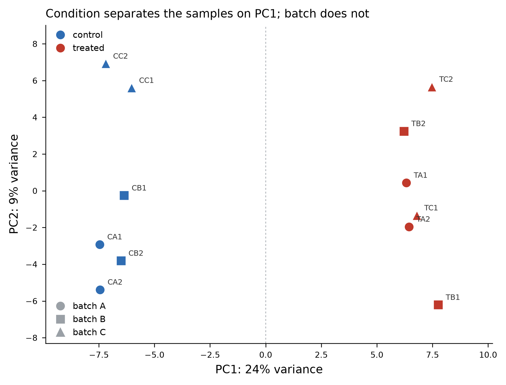
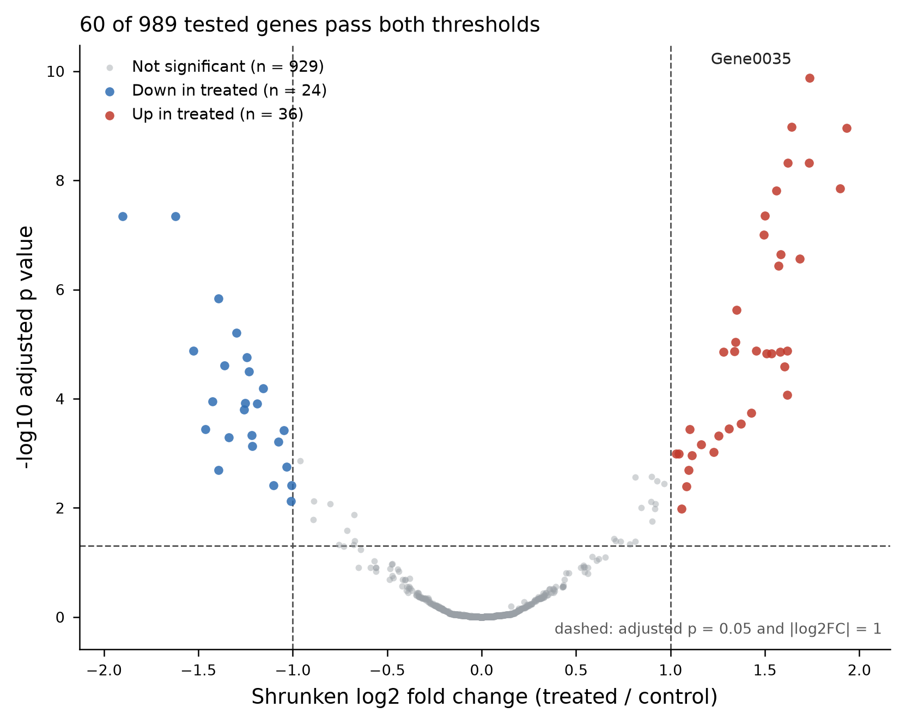
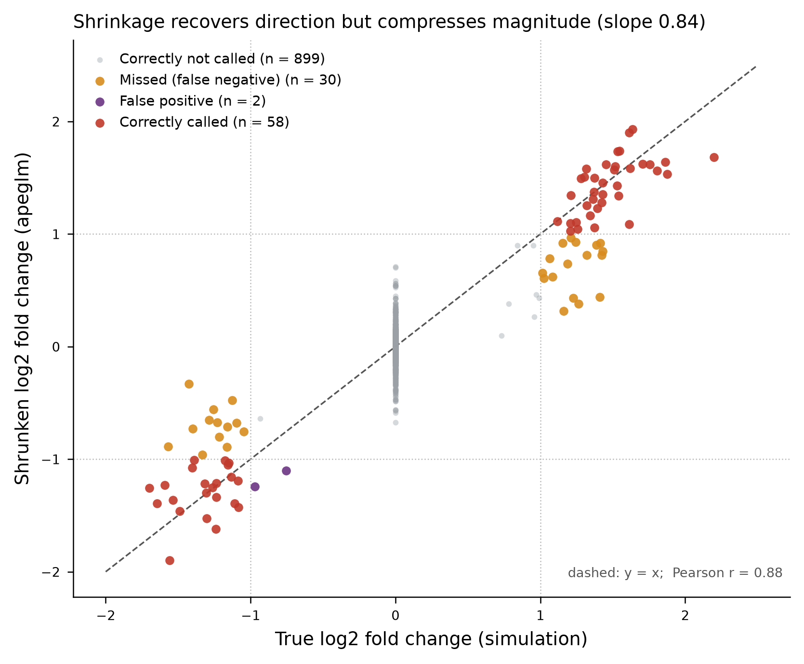

# Week 5 — Interpretation

**Name:** Zhou Hanyi  **Student ID:** _(fill in)_  **Date:** 2026-09-24

**Comparison:** treated versus control, design `~ batch + condition`, control as the
reference level, coefficient `condition_treated_vs_control`.
**Thresholds:** adjusted *p* < 0.05 (Benjamini–Hochberg) **and** |log2 fold change| ≥ 1.

---

## Interpretation (142 words)

The comparison is treated versus control, modelled as `~ batch + condition` across the
989 of 1,000 genes that survived the filter of at least 10 counts in at least 3 samples.
The strongest QC observation is the PCA: PC1 carries 24 % of the variance and separates
the two conditions completely — all six treated samples to the right of zero, all six
controls to the left (*p* = 4 × 10⁻¹²) — while batch explains nothing on PC1
(*p* = 0.99). Sixty genes are significant: 36 up and 24 down in treated. The asymmetry
toward induction is consistent with treatment activating a transcriptional programme
rather than broadly repressing one. The main limitation is six replicates per condition,
which bounds detectable effects near the |log2FC| ≥ 1 cutoff. AI drafted the volcano and
PCA plotting code; I verified the coefficient name, the fold-change direction, and every
threshold against the counts.

---

## Supporting detail

### Design and QC

| | |
|---|---|
| Samples | 12 — 6 control, 6 treated, in 3 balanced batches (2 + 2 each) |
| Library sizes | 112,619 – 151,748 assigned counts (1.35×) |
| Genes detected | 998 – 1,000 of 1,000 per sample |
| Genes tested | 989 of 1,000 (1.1 % removed by the count filter) |
| Model matrix | 12 × 4, rank 4 — full rank |

**Why batch is in the design.** The batches are balanced, so batch is *not* confounded
with condition and the treatment estimate would be unbiased without it. It is included
because it absorbs real between-sample variance that would otherwise inflate the
dispersion estimate and cost power. Balance protects the point estimate; modelling the
batch protects the standard error. This is visible in the PCA: batch contributes nothing
to PC1 (*p* = 0.99) but does structure PC2 (*p* = 0.048), which is exactly the pattern a
nuisance factor worth modelling produces.

**No sample was excluded.** Library sizes span only 1.35×, no sample is displaced from
its group on the PCA, and the assignment's own caution against dropping samples on PCA
evidence alone applies.

### Differential expression

| | |
|---|---|
| Significant (padj < 0.05 **and** \|log2FC\| ≥ 1) | **60** — 36 up, 24 down in treated |
| padj < 0.05 alone, effect size ignored | 83 |
| padj = NA (independent filtering) | 0 |
| Most significant gene | Gene0035, log2FC +1.74, padj 1.3 × 10⁻¹⁰ |

Reporting both thresholds matters here: 83 genes clear the FDR cut, but 23 of them have
fold changes below 2×. Adjusted *p* answers "is this reproducible?", not "is this large".
The 60-gene set is the defensible one.

**Effect of shrinkage.** apeglm moved the median |log2FC| from 0.225 to 0.102 while
leaving every adjusted *p* value unchanged — the expected behaviour, and a check worth
asserting, since a change in the adjusted *p* values would indicate the wrong
coefficient had been shrunk.

### Limitations

- **Six replicates per condition.** Power is adequate for the large planted effects and
  thin near the |log2FC| ≥ 1 boundary; the post-hoc benchmark below quantifies this as
  30 genuinely changed genes missed.
- **No annotation.** Gene identifiers are `Gene0001`-style synthetic labels, all marked
  `protein_coding`. No pathway or functional interpretation is possible, so "activates a
  transcriptional programme" is a statement about the *shape* of the response, not about
  any specific biology.
- **One time point, one dose.** Nothing distinguishes a direct transcriptional response
  from a downstream secondary one.
- **Simulated data.** These counts were generated, not measured. The dispersion structure
  is well behaved in a way real libraries rarely are.

---

## Post-hoc benchmark against the simulation's true effects

The student package ships `Week5_Homework_Gene_Annotation_Instructor_Key.csv`, whose
`truth_log2FC_for_instructor` column holds the effect sizes used to generate the counts.
It appears to be an instructor file.

**It was not used to derive anything.** No threshold, filter, model term or gene list
came from it; the analysis scripts never open it. It is read only afterwards, by
`code/week5_figures_and_benchmark.py`, to ask a question the exercise otherwise cannot
answer: *how well did this workflow recover a signal whose truth is known?*

| Metric | Value |
|---|---|
| Genes truly changed (\|true log2FC\| ≥ 1), among tested | 88 |
| Called significant | 60 |
| True positives | 58 |
| False positives | 2 |
| False negatives | 30 |
| **Sensitivity** | **0.659** |
| **Precision** | **0.967** |
| **Empirical FDR** | **0.033** (nominal target 0.05) |
| Specificity | 0.998 |
| Direction correct among true positives | 58 / 58 |
| Pearson *r*, recovered vs true log2FC | 0.88 |
| Regression slope | 0.843 |
| Median absolute error | 0.099 log2 units |

Three things follow, and they are the most useful result in this homework:

1. **FDR control works.** The empirical false-discovery rate is 0.033 against a nominal
   0.05 — Benjamini–Hochberg is slightly conservative here, as expected, not anti-
   conservative. The two false positives both have true |log2FC| between 0.7 and 1.0,
   i.e. they are real but sub-threshold effects, not noise.
2. **Direction is never wrong.** All 58 correctly called genes have the right sign. This
   is the check that matters most in practice, and it passed completely.
3. **Sensitivity is the binding constraint, not specificity.** 30 of 88 truly changed
   genes were missed — all of them with true effects close to the cutoff, visible in the
   benchmark figure as the orange band between |log2FC| 0.7 and 1.2. With six replicates
   per group, this design is precise but not sensitive: what it reports is trustworthy,
   and it under-reports. The regression slope of 0.84 shows apeglm systematically
   compressing effect sizes toward zero, which is its purpose — and a reason to read
   shrunken fold changes as ranks rather than as calibrated magnitudes.

A further 11 genes were removed before testing by the count filter; 2 of those were
truly changed. That is the price of the filter, and it is small.

---

## Figures

*PCA on variance-stabilised counts. PC1 (24 %) separates condition completely; batch is
shown by marker shape and does not structure PC1.*

*Treated versus control after apeglm shrinkage. Dashed lines are the two thresholds.
Gene0035 is the most significant gene.*

*Recovered against true log2 fold change. The orange band between the dotted cutoffs is
the missed set — genuinely changed genes with effects too close to the threshold for
this sample size.*
