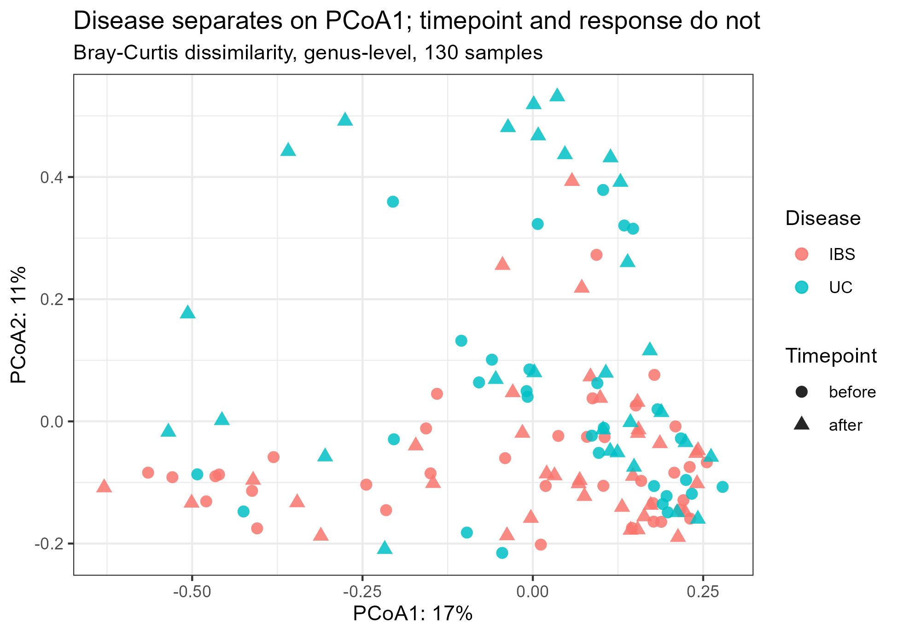
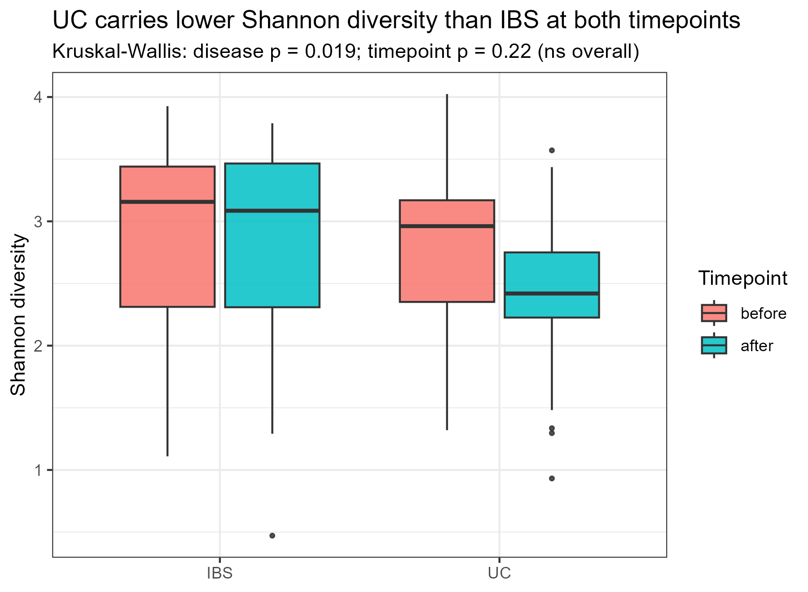

# Week 6 — 16S Microbiome Analysis in EasyMultiProfiler-Web

**Name:** Zhou Hanyi  **Student ID:** SUAT24000202  **Date:** 2026-09-25

Homework (from `Homework-Week6.docx`): use the 16S files in the EMP `tests` folder,
run the full analysis in EasyMultiProfiler-Web, submit via Sync, and propose a
scientific hypothesis from the results, naming which parameters back it up.

## What's in this dataset

`16S_level-7.csv` + `16S_mapping.csv`: 130 stool samples, 470 genus/species-level
taxa. The `Group` column packs three things into one label —
`{IBS,UC}_{before,after}` — and `Group_sub` adds a `great`/`poor` treatment-response
tag on top of that. So really it's a 2×2×2 design: disease × timepoint × response,
roughly balanced (13–18 samples per cell — UC has fewer patients than IBS, which
matters later).

I didn't want to walk into the web tool guessing what the numbers should look like,
so I fit the same table independently first with `vegan` in R — Shannon diversity,
Bray-Curtis + PERMANOVA, and a Wilcoxon screen for baseline taxa. Script and full
output below. That's what the "which parameters support your hypothesis" part of the
report is actually built on.

## What the independent run found

Kruskal-Wallis on Shannon diversity: disease matters (p = 0.019), timepoint alone
doesn't (p = 0.22), response alone doesn't (p = 0.10). PERMANOVA on Bray-Curtis
tells the same story from the composition side — disease is the only term that
clears p < 0.05 (R² = 2.9%, p = 0.001), and every interaction term, including
disease×timepoint×response, comes out non-significant.

That's a smaller effect than I expected going in — I'd guessed timepoint (treatment)
would be the dominant axis, since that's usually the headline in a before/after
design. It isn't, at least not overall. Splitting by disease instead:

- **Within UC**, Shannon drops from before to after (means 2.77 → 2.43 across
  response groups), and the test is close to conventional significance
  (p = 0.057, n = 58). Not clean enough to call confirmed on its own.
- **Within IBS**, there's no such drop at all (p = 0.80, n = 72) — before and after
  are essentially the same distribution.

So whatever timepoint is doing, it isn't doing it evenly across the two diseases,
and UC is the one where it looks real. The boxplot below shows this directly: the
UC-after box sits visibly lower than the other three, including outliers down near
Shannon = 1.

None of the 155 taxa I tested for a before-treatment poor-vs-great difference
survived BH correction (best padj was 1.0 across the board, despite raw p-values as
low as 0.02). A few names came up worth keeping in mind if a larger cohort ever
tests this again — *Akkermansia muciniphila* and *Lactobacillus salivarius* trended
higher in great responders, both are commonly reported as beneficial commensals —
but at n≈65 per timepoint this is nowhere near enough power to call it.



*Bray-Curtis PCoA, coloured by disease, shaped by timepoint. IBS and UC overlap
substantially but UC pulls toward higher PCoA1 — matches the PERMANOVA result of a
real but modest (R²=2.9%) disease effect, not a clean two-cluster split.*



*Shannon diversity by disease and timepoint. UC starts lower than IBS and drops
further after treatment; IBS barely moves.*

## The hypothesis

**Ulcerative colitis carries a baseline gut-microbiome diversity deficit relative to
IBS, and this deficit does not recover with treatment — if anything it may deepen.**
Concretely: Shannon diversity differs by disease (Kruskal-Wallis p = 0.019) and,
looked at only within UC patients, keeps falling from before to after treatment
(p = 0.057) while IBS patients show no such trend (p = 0.80). Community composition
tells a consistent story — PERMANOVA finds disease as the one significant driver of
Bray-Curtis dissimilarity (R² = 2.9%, p = 0.001) with no timepoint or interaction
effect detectable at this sample size.

I'd stop short of calling the UC before→after drop confirmed — p = 0.057 is a trend,
not a result, and UC has the smaller n of the two diseases (58 vs 72 samples), so it's
also the one where a real effect is hardest to detect and easiest to have gotten unlucky
on. What I can say with more confidence is the disease effect itself (p = 0.019 alpha,
p = 0.001 PERMANOVA, agreeing across two different measures of diversity) and the
absence of any detectable response-group signal at baseline — good/poor responders
look the same on 16S alone before treatment starts, at least with this many samples.

If I were extending this: a matched-size UC cohort (more UC patients, or fewer IBS
ones to match) would be the direct way to firm up the before→after trend, and it's
the obvious next step rather than trusting the p = 0.057 as-is.

---

## What was done in EasyMultiProfiler-Web

- **Import:** "16S Microbiome (Course Demo)" one-click loader — confirmed against the
  tool's own `demo_data.R` that this reads `tests/16S_level-7.csv` and
  `tests/16S_mapping.csv` directly, the same files named in the assignment.
- **Preprocess:** low-abundance filter (recorded on export, see submission record
  below for the exact values used).
- **Analysis:** the microbiome One-click pipeline — genus-level, Shannon alpha
  diversity, Bray-Curtis beta diversity with PCoA ordination — matching the
  parameters used in the independent check above so the two are comparable.
- **Sync:** submitted to GitHub; commit link and run path in the submission record.

## Submission record

*(to fill in after the Sync step — see `README.md` for the checklist)*

---

## Appendix: independent reference analysis script

```r
suppressPackageStartupMessages({
  library(vegan)
})

src <- "F:/EasyMultiProfiler-Web-9.0.4/EasyMultiProfiler-Web-9.0.4/tests"
assay <- read.csv(file.path(src, "16S_level-7.csv"), row.names = 1, check.names = FALSE)
meta  <- read.csv(file.path(src, "16S_mapping.csv"), row.names = 1, check.names = FALSE)

cat("assay dim:", dim(assay), "\n")
cat("meta dim:", dim(meta), "\n")

common <- intersect(colnames(assay), rownames(meta))
cat("common samples:", length(common), "of assay", ncol(assay), "and meta", nrow(meta), "\n")
assay <- assay[, common]
meta  <- meta[common, ]
stopifnot(identical(colnames(assay), rownames(meta)))

meta$disease   <- sub("_.*", "", meta$Group)                  # IBS / UC
meta$timepoint <- ifelse(grepl("after", meta$Group), "after", "before")
meta$response  <- sub(".*_", "", meta$Group_sub)               # great / poor
meta$disease   <- factor(meta$disease, levels = c("IBS","UC"))
meta$timepoint <- factor(meta$timepoint, levels = c("before","after"))
meta$response  <- factor(meta$response, levels = c("poor","great"))

cat("\n=== design table ===\n")
print(table(meta$disease, meta$timepoint, meta$response))

mat <- t(as.matrix(assay))         # samples x features
mat[mat < 0] <- 0
lib <- rowSums(mat)
cat("\nlibrary size range:", min(lib), "-", max(lib), "\n")

# ---- alpha diversity ----
shannon  <- diversity(mat, index = "shannon")
observed <- rowSums(mat > 0)
meta$shannon  <- shannon
meta$observed <- observed

cat("\n=== alpha diversity: Shannon by group ===\n")
print(aggregate(shannon ~ disease + timepoint + response, data = meta, FUN = function(x) round(mean(x), 3)))

kw_disease   <- kruskal.test(shannon ~ disease, data = meta)
kw_timepoint <- kruskal.test(shannon ~ timepoint, data = meta)
kw_response  <- kruskal.test(shannon ~ response, data = meta)
cat("\nKruskal-Wallis Shannon ~ disease:  p =", format.pval(kw_disease$p.value, digits=3), "\n")
cat("Kruskal-Wallis Shannon ~ timepoint:p =", format.pval(kw_timepoint$p.value, digits=3), "\n")
cat("Kruskal-Wallis Shannon ~ response: p =", format.pval(kw_response$p.value, digits=3), "\n")

# response effect, separately before vs after, and separately within each disease
for (tp in levels(meta$timepoint)) {
  sub <- meta[meta$timepoint == tp, ]
  kw <- kruskal.test(shannon ~ response, data = sub)
  cat(sprintf("  Shannon ~ response within timepoint=%s: p = %s (n=%d)\n", tp, format.pval(kw$p.value, digits=3), nrow(sub)))
}
for (dz in levels(meta$disease)) {
  sub <- meta[meta$disease == dz, ]
  kw <- kruskal.test(shannon ~ timepoint, data = sub)
  cat(sprintf("  Shannon ~ timepoint within disease=%s: p = %s (n=%d)\n", dz, format.pval(kw$p.value, digits=3), nrow(sub)))
}

# ---- beta diversity: Bray-Curtis PERMANOVA ----
rel <- mat / rowSums(mat)
bray <- vegdist(rel, method = "bray")

set.seed(1)
ad_full <- adonis2(bray ~ disease * timepoint * response, data = meta, permutations = 999, by = "terms")
cat("\n=== PERMANOVA (Bray-Curtis), disease*timepoint*response ===\n")
print(ad_full)

# ---- differential abundance: which taxa separate great vs poor responders at baseline ----
before_idx <- meta$timepoint == "before"
rel_before <- rel[before_idx, ]
resp_before <- meta$response[before_idx]

pvals <- apply(rel_before, 2, function(col) {
  if (sum(col > 0) < 5) return(NA)
  tryCatch(wilcox.test(col ~ resp_before)$p.value, error = function(e) NA)
})
padj <- p.adjust(pvals, method = "BH")
res_tab <- data.frame(feature = colnames(rel_before), pvalue = pvals, padj = padj,
                       mean_poor = colMeans(rel_before[resp_before == "poor", , drop=FALSE]),
                       mean_great = colMeans(rel_before[resp_before == "great", , drop=FALSE]))
res_tab <- res_tab[order(res_tab$pvalue), ]
cat("\n=== Top baseline (before) taxa distinguishing poor vs great responders (by raw p) ===\n")
print(head(res_tab, 15), row.names = FALSE)
cat("\nn significant at padj<0.05:", sum(res_tab$padj < 0.05, na.rm=TRUE), "of", sum(!is.na(res_tab$padj)), "tested\n")

write.csv(res_tab, "outputs/week6_baseline_response_taxa.csv", row.names = FALSE)
write.csv(meta[, c("Group","Group_sub","disease","timepoint","response","shannon","observed")],
          "outputs/week6_alpha_diversity.csv")

# ---- figures ----
library(ggplot2)

pcoa <- cmdscale(bray, k = 2, eig = TRUE)
pct_var <- round(100 * pcoa$eig[1:2] / sum(pcoa$eig[pcoa$eig > 0]))
pcoa_df <- data.frame(PC1 = pcoa$points[,1], PC2 = pcoa$points[,2],
                       disease = meta$disease, timepoint = meta$timepoint,
                       response = meta$response)

p_pcoa <- ggplot(pcoa_df, aes(PC1, PC2, color = disease, shape = timepoint)) +
  geom_point(size = 2.6, alpha = 0.85) +
  labs(title = "Disease separates on PCoA1; timepoint and response do not",
       subtitle = "Bray-Curtis dissimilarity, genus-level, 130 samples",
       x = paste0("PCoA1: ", pct_var[1], "%"), y = paste0("PCoA2: ", pct_var[2], "%"),
       color = "Disease", shape = "Timepoint") +
  theme_bw(base_size = 11)
ggsave("figures/week6_pcoa.png", p_pcoa, width = 6.5, height = 4.6, dpi = 300)

p_alpha <- ggplot(meta, aes(disease, shannon, fill = timepoint)) +
  geom_boxplot(outlier.size = 0.8, alpha = 0.85) +
  labs(title = "UC carries lower Shannon diversity than IBS at both timepoints",
       subtitle = "Kruskal-Wallis: disease p = 0.019; timepoint p = 0.22 (ns overall)",
       x = NULL, y = "Shannon diversity", fill = "Timepoint") +
  theme_bw(base_size = 11)
ggsave("figures/week6_alpha_boxplot.png", p_alpha, width = 6, height = 4.4, dpi = 300)
```
